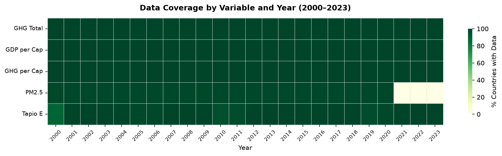
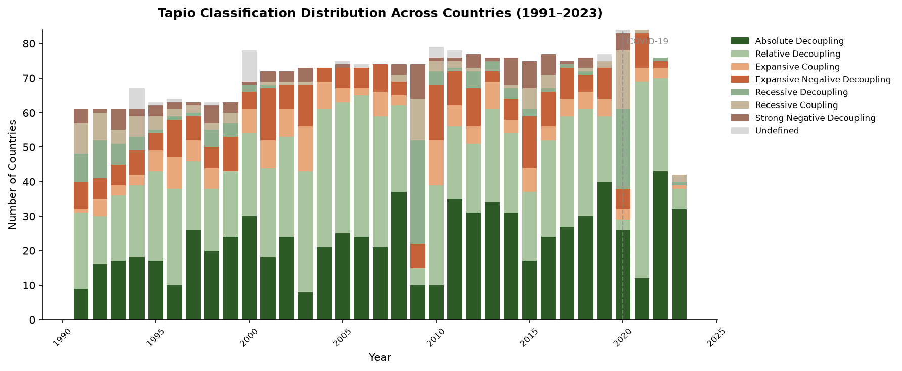
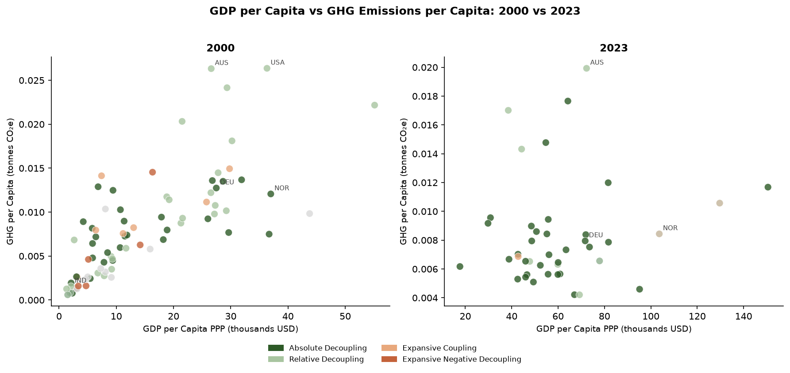
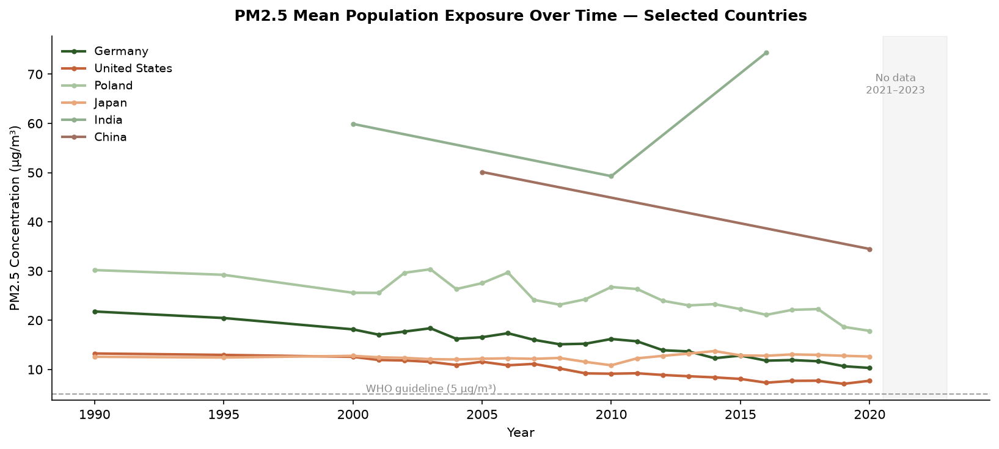

# Introduction

This technical report describes the datasets used in the *Breaking the Link* data visualization project, which explores the decoupling of economic growth from greenhouse gas (GHG) emissions across countries. The report covers the origin, structure, and quality of each dataset, as well as the preprocessing decisions made to prepare the data for visualization.

The central research question guiding the project is: **Can a nation expand its economy while simultaneously shrinking its environmental footprint?** To answer this, we integrate four primary datasets covering GHG emissions, GDP per capita, air pollution exposure, and climate projections.

# Dataset Overview

## GHG Emissions (OECD)

**Source:** OECD Data Explorer — Air and GHG Emissions (`DSD_AIR_GHG@DF_AIR_GHG`)  
**URL:** [data-explorer.oecd.org](https://data-explorer.oecd.org)  
**Format:** CSV (long format)  
**Time range:** 1985–2023  
**Raw rows:** ~636,000  

### Structure and Variables

The dataset contains emissions data across multiple pollutants, measures, and units. The key variables retained after filtering are:

| Variable | Description |
|----------|-------------|
| `REF_AREA` | ISO-3 country code |
| `TIME_PERIOD` | Year of observation |
| `OBS_VALUE` | GHG emissions value |
| `MEASURE` | Type of measure (total, per capita, etc.) |
| `UNIT_MEASURE` | Unit (tonnes CO₂-equivalent, kg per person, etc.) |
| `POLLUTANT` | Pollutant type (GHG, CO₂, etc.) |

The raw file contains 30 columns, of which 7 are entirely redundant (e.g., structural metadata fields with no analytical value).

### Filtering Applied

To obtain a clean, unambiguous time series suitable for the Tapio Index calculation, three filters were applied simultaneously:

- `MEASURE = "_T"` — total emissions, excluding sector breakdowns
- `UNIT_MEASURE = "T_CO2E"` — tonnes of CO₂-equivalent
- `POLLUTANT = "GHG"` — all greenhouse gases (excluding CO₂-only rows which would create duplicate country-year pairs)

These filters reduce the dataset to approximately 2,500 rows covering 94 entities. After excluding aggregate codes (OECD, EU27_2020, OECDA, OECDE, OECDSO), **47 individual countries** remain. Of these, **37 countries** have complete data for the full 2000–2023 period.

### Data Quality

- **Missing values:** Minimal for established OECD members; newer members (e.g., Colombia, Costa Rica) have gaps in early years
- **Encoding issues:** Three country names contain encoding artifacts due to UTF-8 mishandling: `Türkiye`, `China (People's Republic of)`, and `Côte d'Ivoire`. These are corrected during preprocessing via an ISO-3 lookup table
- **Aggregate codes:** Entities such as `OECD`, `OECDA`, `OECDE`, `OECDSO`, and `EU27_2020` are present and must be excluded to avoid inflating country counts
- **Coverage note:** Cuba, Liechtenstein, Monaco, and Vatican appear in the GHG dataset but not in the GDP dataset, resulting in their exclusion from the merged panel

## GDP per Capita PPP (World Bank)

**Source:** World Bank Open Data — GDP per capita, PPP (current international $)  
**Indicator:** `NY.GDP.PCAP.PP.CD`  
**URL:** [data.worldbank.org](https://data.worldbank.org/indicator/NY.GDP.PCAP.PP.CD)  
**Format:** CSV (wide format, 4 metadata rows at top)  
**Time range:** 1960–2024  

### Structure and Variables

Unlike the OECD datasets, the World Bank provides this data in **wide format**, with each year as a separate column header. The file must be melted into long format during preprocessing.

| Variable | Description |
|----------|-------------|
| `Country Code` | ISO-3 country code (primary key) |
| `1960, 1961, ...` | GDP per capita PPP value for each year |

### Filtering and Transformation

The dataset is melted from wide to long format, retaining years 1990–2023 to align with the GHG time series. The resulting key variable is `gdp_pc_ppp_usd`.

### Data Quality

- **Missing values:** 24 missing values in 2000, 19 in 2020, 21 in 2023 — these occur primarily for smaller or less-reported economies
- **Format challenge:** The 4-row metadata header requires `skiprows=4` when reading with pandas
- **Coverage:** The World Bank dataset covers significantly more countries than the OECD GHG dataset, so the inner join during merging limits the final panel to countries present in both sources

## PM2.5 Air Pollution Exposure (OECD)

**Source:** OECD Data Explorer — Exposure to Air Pollution (`DSD_AIR_POL@DF_AIR_POLL`)  
**Format:** CSV (long format)  
**Time range:** 1990–2020 (no data available for 2021–2023)  
**Raw rows:** ~244,000  

### Structure and Variables

The dataset contains 11 rows per country-year combination, corresponding to different measurement types and WHO threshold bands. The key distinction is between:

- `MEASURE = "MEAN_POP"` with `EXPOSURE_LEVEL = "_Z"` — mean population-weighted PM2.5 concentration in µg/m³ **(selected)**
- `MEASURE = "POP_EXP_POL"` — share of population exposed at 10 different WHO threshold bands (10 rows per country-year) **(excluded)**

We selected the mean concentration measure as it provides an objective, continuous, and internationally comparable value directly aligned with WHO guidelines (5 µg/m³ annual mean).

| Variable | Description |
|----------|-------------|
| `REF_AREA` | ISO-3 country code |
| `TIME_PERIOD` | Year of observation |
| `OBS_VALUE` | Mean PM2.5 concentration (µg/m³) |

### Data Quality

- **Time range limitation:** Data ends in 2020. For the dashboard, years 2021–2023 are left as NaN and the UI restricts the PM2.5 view to 2000–2020
- **Duplicate risk:** Without the dual filter (`MEAN_POP` + `_Z`), 11 rows per country-year are returned, causing duplicate key errors and corrupting the Tapio Index calculation (pct_change returns 0 on duplicates, triggering the near-zero GDP guard)
- **Coverage:** Broader than OECD-only, covering most countries in the merged panel

## Climate Projections by SSP Scenario (OECD)

**Source:** OECD Data Explorer — Climate Projections (`DSD_REG_CLIM@DF_CLIM_PROJ`)  
**Format:** CSV (~1.5 GB uncompressed)  
**Time range:** 2030–2060  
**Countries:** 38 OECD members  

### Structure and Variables

This dataset provides projections of three climate indicators under four SSP scenarios:

| Measure | Description |
|---------|-------------|
| `HOT_DAYS_PROJ` | Projected number of days per year where max temperature > 35°C |
| `TROP_NIGHTS_PROJ` | Projected number of nights per year where min temperature > 20°C |
| `ICING_DAYS_PROJ` | Projected number of days per year where max temperature < 0°C |

The four scenarios covered are:

| Scenario | Label |
|----------|-------|
| `PROJ_SSP126` | Low-emissions (SSP1-2.6) |
| `PROJ_SSP245` | Middle-of-the-road (SSP2-4.5) |
| `PROJ_SSP370` | High-emissions (SSP3-7.0) |
| `PROJ_SSP585` | Very high emissions (SSP5-8.5) |

### Linking to the Tapio Index

A key design decision in this project is linking each country's current Tapio Decoupling classification to a corresponding SSP scenario, creating a narrative bridge between present economic behaviour and projected future climate:

| Tapio Classification | Assigned SSP Scenario |
|---------------------|-----------------------|
| Absolute Decoupling | SSP1-2.6 (best case) |
| Relative Decoupling | SSP2-4.5 |
| Expansive Coupling | SSP3-7.0 |
| Expansive/Strong Negative Decoupling | SSP5-8.5 (worst case) |

This mapping allows View 3 of the dashboard to show users: *"if your country continues on its current trajectory, here is what the climate could look like by 2050."*

### Data Quality

- **File size:** At ~1.5 GB, this file cannot be processed in a single pandas read. It is read in chunks of 100,000 rows and filtered progressively
- **Missing values:** None — zero values are legitimate and indicate no projected hot days, tropical nights, or icing days for that country-scenario combination
- **Coverage limitation:** Only 38 OECD countries are covered, meaning View 3 of the dashboard will display grey for non-OECD countries
- **Encoding issues:** Same UTF-8 encoding problems as the GHG dataset for `Türkiye` and `China (People's Republic of)`
- **Column redundancy:** 24 out of 36 columns are irrelevant metadata and are dropped during preprocessing

# Data Integration and Preprocessing

## Merged Panel

The four datasets are joined into a single `merged_panel.csv` using `(iso3, year)` as a composite key:

1. **GHG total emissions** ← inner join with **GDP per capita** (only countries with both variables)
2. Result ← left join with **GHG per capita** (tooltip layer)
3. Result ← left join with **PM2.5** (2021–2023 will be NaN by design)

The final panel covers **42 countries** and **34 years** (1990–2023), yielding approximately 1,400 rows.

## Tapio Elasticity Index

The Tapio Decoupling Elasticity Index (E) is computed as:

$$E = \frac{\Delta\%\text{GHG}}{\Delta\%\text{GDP}}$$

Where $\Delta\%$ denotes the year-over-year percentage change. The index is left undefined when GDP growth is near zero (|Δ%GDP| < 0.01) to avoid division by extremely small numbers.

A **5-year rolling mean** of E is also computed to smooth COVID-2020 outliers and other short-term shocks, providing a more stable signal for the choropleth map. Countries are then classified into Tapio's 8-category typology:

| Category | Condition |
|----------|-----------|
| Absolute Decoupling | GDP↑, E ≤ 0 |
| Relative Decoupling | GDP↑, 0 < E < 0.8 |
| Expansive Coupling | GDP↑, 0.8 ≤ E < 1.2 |
| Expansive Negative Decoupling | GDP↑, E ≥ 1.2 |
| Recessive Decoupling | GDP↓, E > 1.2 |
| Recessive Coupling | GDP↓, 0 < E ≤ 1.2 |
| Strong Negative Decoupling | GDP↓, E ≤ 0 |
| Undefined | Near-zero GDP growth or missing data |

## Known Limitations

- **PM2.5 gap (2021–2023):** No PM2.5 data is available for recent years. The dashboard restricts the air quality view to 2000–2020 and notes this limitation explicitly
- **Country coverage asymmetry:** The climate projections dataset covers only 38 OECD countries, while the historical panel covers 42. This means View 3 will have incomplete global coverage
- **COVID-2020 distortion:** The 2020 year shows extreme Tapio values for most countries due to simultaneous GDP and emissions collapses. The 5-year rolling average mitigates this but annual view will still show anomalies
- **GHG per capita vs total:** The Tapio Index is calculated using **total** GHG emissions (not per capita), as the decoupling relationship is between aggregate economic output and aggregate environmental pressure. Per capita figures are retained as a tooltip layer only
- **Interpolation:** Linear interpolation is applied within country groups to fill internal gaps in the PM2.5 and GDP series, which may introduce slight inaccuracies for countries with extended missing periods

# Exploratory Data Analysis

## Data Coverage

Figure 1 shows the percentage of countries with available data for each key variable across years. GHG, GDP, and GHG per capita are complete throughout the panel. PM2.5 stands out as the most significant gap — data is entirely missing for 2021–2023 and sparsely available before 2000, which directly shapes the design of View 2 in the dashboard.

{width=100%}

## Tapio Classification Distribution

Figure 2 shows how countries are distributed across Tapio categories each year. The growing dominance of absolute and relative decoupling from 2010 onwards reflects the global shift toward cleaner energy. The COVID-19 spike in 2020 is clearly visible — many countries temporarily enter recessive categories due to simultaneous GDP and emissions collapses, confirming the need for the 5-year rolling average in the dashboard.

{width=100%}

## GDP vs GHG Emissions

Figure 3 compares GDP per capita against GHG emissions per capita in 2000 and 2023. The shift is striking — in 2023, countries are richer but clustered at lower emission levels, and the dominant colour has shifted toward dark green (absolute decoupling). This directly validates the core narrative of the dashboard.

{width=100%}

## PM2.5 Air Quality Trends

Figure 4 shows PM2.5 exposure trends for a selection of countries. Western nations (Germany, USA, Japan) show consistent decline toward but still above the WHO guideline of 5 µg/m³. China shows a declining trend after peaking around 2006. India remains persistently high. The data gap after 2020 is clearly marked and is acknowledged as a limitation in View 2 of the dashboard.

{width=100%}

# Conclusion

The four datasets used in this project are of generally high quality and well-suited for the intended visualization. The primary challenges encountered were encoding inconsistencies in country names, the 11-row-per-country-year structure of the PM2.5 dataset requiring careful filtering, and the large file size of the climate projections dataset requiring chunk-based processing. All issues have been addressed in the preprocessing pipeline (`panel.py`), which is fully reproducible and documented in the project repository.

The merged panel of 42 countries across 34 years provides sufficient coverage to tell a compelling global story about economic decoupling, with the climate projections adding a forward-looking narrative dimension that connects present behaviour to future consequences.

*Report prepared as Deliverable 2 for the Data Visualization course.*  
*Data sources: OECD Data Explorer, World Bank Open Data.*  
*Code repository: [github.com/kristine-p/economic-decoupling-dataviz](https://github.com/kristine-p/economic-decoupling-dataviz)*
